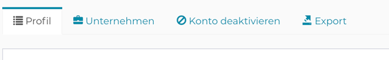
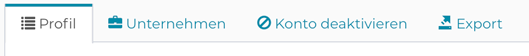
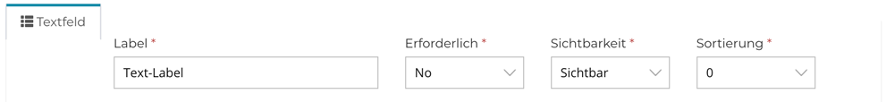
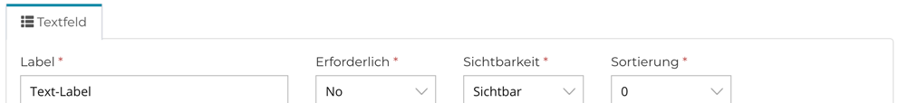

mailwizz-fix-css
================

Fixes CSS in the `customer` view of the **[MailWizz](https://mailwizz.com/)** EMA.

### Implemented fixes:

1. **Customer > My Account** navigation tabs
  

2. **Survey > Custom fields** panel border and row with label, required and so on
  

 
## Usage
1. Download the extension (zip file) from releases
2. Install the extension in the backend of your MailWizz EMA
3. Activate the extension
